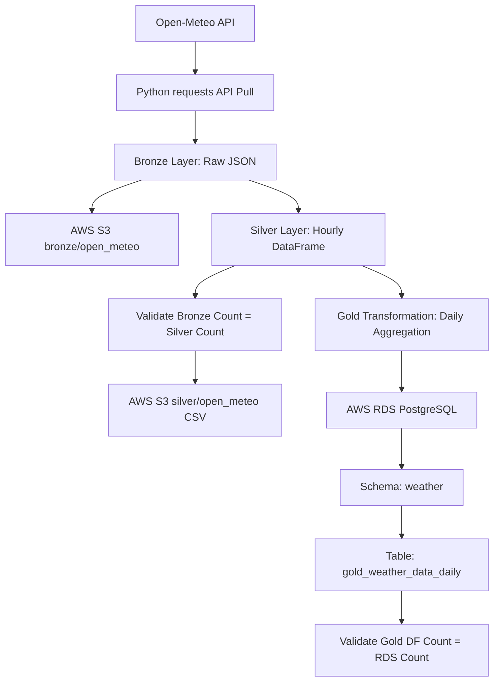

# Open-Meteo Pipeline Architecture Diagram

## Text Diagram

```text
+-------------------+
|  Open-Meteo API   |
+---------+---------+
          |
          v
+-------------------+
| Python requests   |
| API Pull          |
+---------+---------+
          |
          v
+-----------------------------+
| Bronze Layer                |
| Raw JSON                    |
| S3: bronze/open_meteo/      |
+-------------+---------------+
              |
              v
+-----------------------------+
| Silver Layer                |
| Hourly cleaned CSV          |
| S3: silver/open_meteo/      |
+-------------+---------------+
              |
              v
+-----------------------------+
| Gold Transformation         |
| Daily pandas aggregation    |
| avg/min/max temp            |
| precipitation sum           |
| avg wind speed              |
+-------------+---------------+
              |
              v
+-----------------------------+
| AWS RDS PostgreSQL          |
| Schema: weather             |
| Table: gold_weather_data_daily |
+-------------+---------------+
              |
              v
+-----------------------------+
| Validation                  |
| Gold DF count = RDS count   |
+-----------------------------+
```

## Mermaid Diagram


